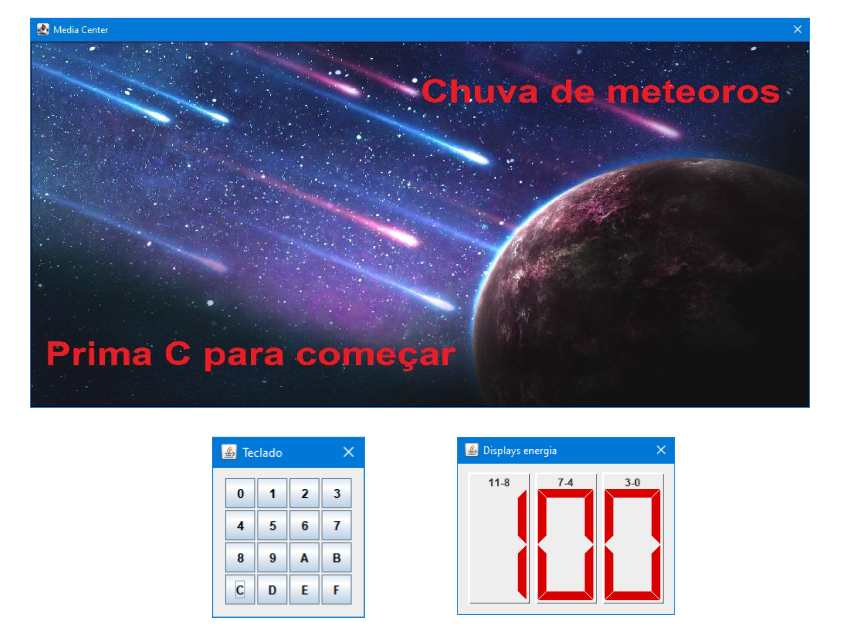
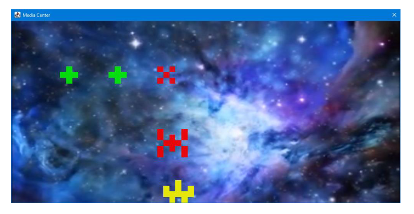

# Introdução à Arquitetura de Computadores - Projeto
## Chuva de meteoros - Objetivos

Este projeto pretende exercitar os fundamentos da área de Arquitetura de Computadores,
nomeadamente a programação em linguagem _assembly_ , os periféricos e as interrupções.

O objetivo deste projeto consiste em concretizar um jogo de simulação de um rover a defender o
planeta X, que deve obter energia de meteoros bons e destruir meteoros maus, que não são mais do
que naves robô enviadas para invadir o planeta. A interface consiste num ecrã, um teclado para controlo
do jogo e um conjunto de displays, para mostrar a energia do rover.

O módulo MediaCenter do simulador possui variadas capacidades multimédia, permitindo definir
imagens de fundo, reproduzir sons e vídeos, vários planos de imagens construídas pixel a pixel, um
cenário frontal para letreiros, etc. O guião de laboratório 4 fornece mais detalhes sobre este módulo.

O teclado permite, fazendo clique em algumas das teclas, fazer o comando do jogo ( _start_ , _pause_ e _stop_ ,
para além de controlar a posição do rover).

Os displays permitem exibir a energia atual do rover, que vai variando com o tempo.

Cada estado do jogo (inicial, a jogar, em pausa, terminado, etc.) deve ter um cenário ou vídeo de fundo
diferente, ou um letreiro (cenário frontal, uma imagem com letras e fundo transparente), de forma a dar
uma indicação visual do estado do jogo. A figura da página anterior ilustra um possível cenário de
entrada, em que o utilizador tem de premir a tecla C para iniciar o jogo. Também pode ser um vídeo,
com as letras sobrepostas por meio de um cenário frontal (com fundo transparente).

A ideia genérica do jogo é a seguinte:

- O rover está no fundo ecrã (superfície do planeta) e só pode movimentar-se (por teclas) para a
esquerda e para a direita;
- Do topo de ecrã vão aparecendo os meteoros vindos de muito longe, pelo que quando
aparecem são apenas um pixel cinzento. Estes meteoros vão descendo na vertical e
aumentando de tamanho à medida que se vão aproximando do rover. No segundo tamanho (2 x
2 pixels) ainda estão distantes e são cinzentos e indistintos, mas a partir daí mudam de forma e
cor consoante sejam meteoros bons (verdes) ou maus (naves inimigas, vermelhas), tal como
ilustrado pela figura seguinte;
- O objetivo do rover é destruir as naves inimigas (disparando um míssil), para defender o
planeta, e obter energia dos meteoros bons (permitindo que eles colidam consigo);

- A colisão de um míssil com um meteoro (bom ou nave inimiga) implica a sua destruição e do
meteoro, com um efeito de explosão. Atenção, que o míssil tem um alcance limitado (não pode
assim atingir meteoros distantes);
- As naves inimigas não destruídas e meteoros bons não aproveitados perdem-se pelo fundo do
ecrã. Sempre que uma nave inimiga é destruída, um meteoro bom colide com o rover ou
qualquer deles se perde no fundo, um novo nasce no topo, com tipo (meteoro bom ou nave
inimiga) escolhido de forma pseudo-aleatória (25% meteoro bom, 75% nave inimiga);
- O rover tem uma energia inicial ( 100 %). Essa energia vai-se gastando ao longo do tempo, só
pelo facto de o rover estar em funcionamento. Disparar um míssil gasta energia adicional. No
entanto, colidir com um meteoro bom e destruir uma nave inimiga aumenta essa energia;
- O jogo termina se uma nave inimiga colidir com o rover ou se a energia chegar a zero. O objetivo
do jogo consiste assim em aguentar o rover durante tanto tempo quanto possível, obtendo
energia dos meteoros bons e naves destruídas e evitando colidir com uma nave inimiga;
- O jogador deve ter hipótese de fazer pausa ao jogo, bem como recomeçar após pausa, terminar
o jogo em qualquer altura e começar novo jogo após o anterior terminar.